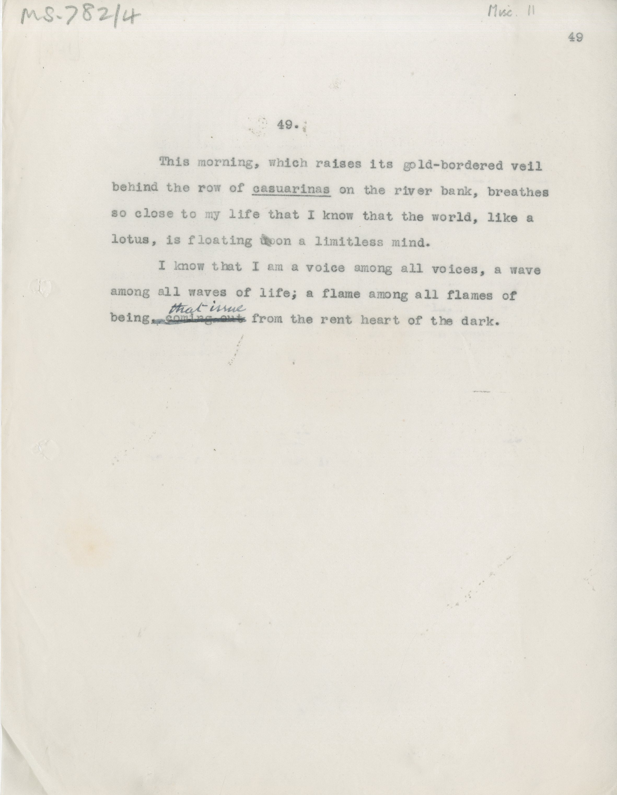

# MS 782/4

[Misc 11]

49. 

&nbsp;&nbsp;&nbsp;&nbsp;&nbsp;This morning, which raises its gold-bordered veil \
behind the row of casuarinas [underlined] on the river bank, breathes \
so close to my life that I know that the world, like a \
lotus, is floating ~~up~~on a limitless mind. \
&nbsp;&nbsp;&nbsp;&nbsp;&nbsp;I know that I am a voice among the voices, a wave \
among all waves of life; a flame among all flames of \
being, ~~coming out~~ ^that issue from the rent heart of the dark. 

