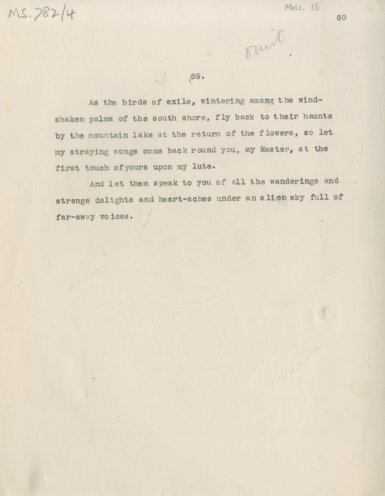

# MS 782/4

[Misc 15]

59. [omit] 

&nbsp;&nbsp;&nbsp;&nbsp;&nbsp;As the birds of exile, wintering among the wind- \
shaken palms of the south shore, fly back to their haunts \
by the mountain lake at the return of the flowers, so let \
my straying songs come back round you, my Master, at the \
first touch of yours upon my lute. \
&nbsp;&nbsp;&nbsp;&nbsp;&nbsp;And let them speak to you of all the wanderings and \
strange delights and heart-aches under an alien sky full of \
far-away voices. 

