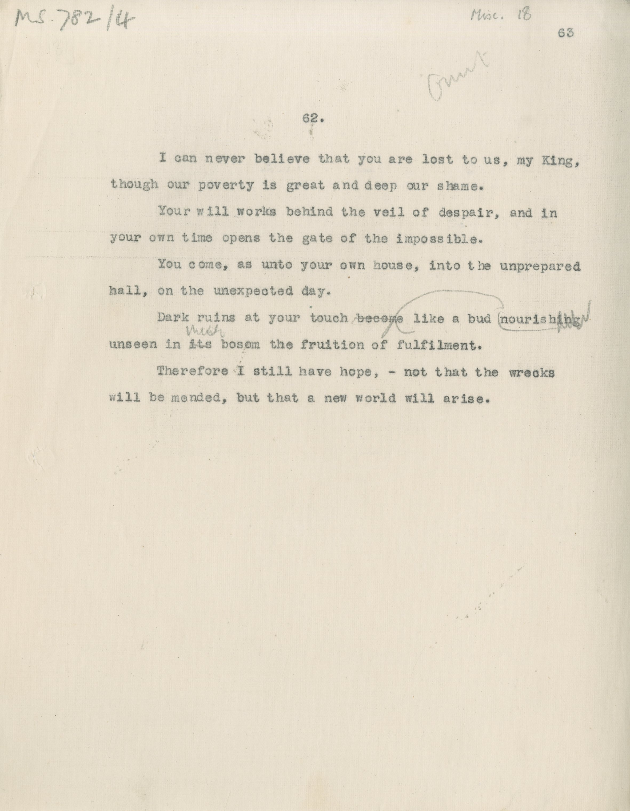

# MS 782/4

[Misc 18]

62. [omit] 

&nbsp;&nbsp;&nbsp;&nbsp;&nbsp;I can never believe that you are lost to us, my King, \
though our poverty is great and deep our shame. \
&nbsp;&nbsp;&nbsp;&nbsp;&nbsp;Your will works behind the veil of despair, and in \
your own time opens the gate of the impossible. \
&nbsp;&nbsp;&nbsp;&nbsp;&nbsp;You come, as unto your house, into the unprepared \
hall, on the unexpected day. \
&nbsp;&nbsp;&nbsp;&nbsp;&nbsp;Dark ruins at your touch ~~become~~ ^nourish^ like a bud ~~nourishing~~ \
unseen in ~~its~~ ^?^ bosom the fruition of fulfilment. \
&nbsp;&nbsp;&nbsp;&nbsp;&nbsp;Therefore I still have hope, - not that the wrecks \
will be mended, but that a new world will arise. 

